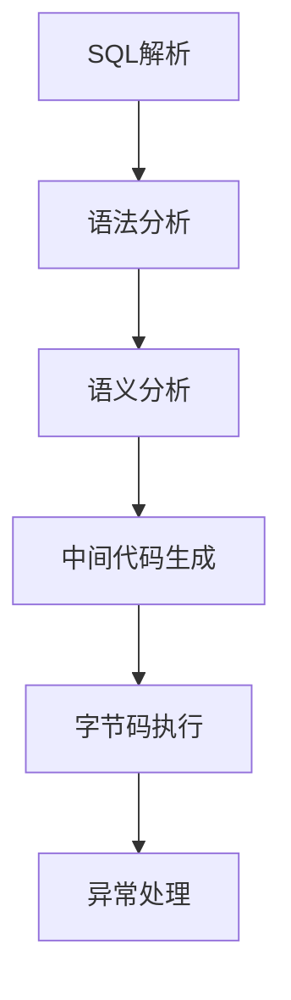
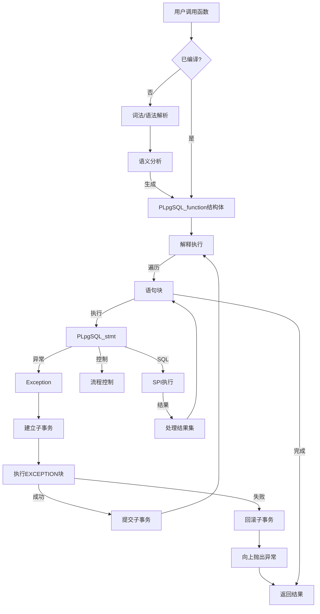

# PostgreSQL PL/pgSQL 语言底层设计原理详解

---

## 目录
1. **PL/pgSQL概述**
2. **设计目标与架构**
3. **执行流程解析**
4. **核心组件与机制**
5. **优化与性能特征**
6. **优缺点分析**
7. **典型应用场景**
8. **与其它存储过程语言对比**
9. **总结**

---

## 1. PL/pgSQL概述
### 1.1 基本定义
PL/pgSQL是PostgreSQL数据库专用的过程式编程语言，结合：
- SQL的数据操作能力
- 过程式语言的控制结构（条件/循环/异常）
- 复杂数据类型支持

### 1.2 发展历程
- 1998年首次集成到PostgreSQL 6.4
- 设计灵感源自Oracle PL/SQL
- 持续演进支持新特性（如JSON处理、窗口函数等）

---

## 2. 设计目标与架构
### 2.1 核心设计目标
- **减少客户端-服务端交互**：批量执行逻辑
- **原生SQL集成**：直接嵌入执行计划
- **事务一致性**：遵循ACID原则
- **安全沙箱**：作为trusted language运行

### 2.2 整体架构
```plaintext
        +---------------------+
        |  PL/pgSQL Function  |
        +---------------------+
                   |
                   v
        +---------------------+
        |  语法解析与AST生成   |
        +---------------------+
                   |
                   v
        +---------------------+
        |  语义分析与校验     |
        +---------------------+
                   |
                   v
        +---------------------+
        | 执行计划生成与优化  |
        +---------------------+
                   |
                   v
        +---------------------+
        |  字节码编译与缓存   |
        +---------------------+
                   |
                   v
        +---------------------+
        |   SPI 执行引擎      |
        +---------------------+
```

---






## 3. 执行流程解析

### 3.1 全生命周期处理
1. **解析阶段**：
   - 词法分析（Lex）
   - 语法分析（Yacc）
   - 生成抽象语法树（AST）

2. **编译阶段**：
   - 符号表构建
   - 类型检查
   - 生成中间表示（IR）

3. **执行阶段**：
   - 通过SPI接口与执行引擎交互
   - 使用Executor处理SQL语句
   - 管理执行上下文

### 3.2 执行引擎关键机制
- **SPI管理器**：
  ```c
  SPI_connect()  // 进入子事务上下文
  SPI_prepare()  // 准备SQL语句
  SPI_execute()  // 执行预编译语句
  SPI_finish()   // 释放资源
  ```
- **执行计划缓存**：
  - LRU缓存策略
  - 基于查询指纹的哈希存储
  - 自动失效机制（Schema变更时）

---

## 4. 核心组件与机制
### 4.1 变量处理系统
- **存储结构**：
  ```pgsql
  DECLARE
    var1 INT := 10;          -- 标量变量
    arr1 INT[] := ARRAY[1,2];-- 数组
    rec1 RECORD;             -- 记录类型
  ```
- **内存管理**：
  - 使用MemoryContext管理生命周期
  - 默认使用函数级上下文

### 4.2 异常处理机制
- 嵌套式异常栈：
  ```pgsql
  BEGIN
    -- 业务逻辑
  EXCEPTION 
    WHEN division_by_zero THEN
      -- 处理程序
    WHEN OTHERS THEN
      RAISE EXCEPTION 'Unhandled error';
  END;
  ```
- 错误代码映射：
  - 与SQLSTATE标准完全兼容
  - 支持自定义异常（RAISE语句）

### 4.3 执行优化策略
- **静态SQL优化**：
  ```pgsql
  EXECUTE 'SELECT * FROM ' || table_name;  -- 动态SQL（无优化）
  SELECT * FROM table1;                   -- 静态SQL（可优化）
  ```
- **JIT编译**（PostgreSQL 11+）：
  - 将热点代码编译为机器码
  - 支持LLVM后端加速

---

## 5. 性能特征与优化
### 5.1 性能优势场景
- 事务性批处理（相比应用层处理快3-5倍）
- 复杂计算下推（减少网络传输）
- 预处理语句重用（n次调用1次解析）

### 5.2 性能监控方法
- **内置统计视图**：
  ```sql
  SELECT * FROM pg_stat_user_functions;
  ```
- **执行时间分析**：
  ```sql
  EXPLAIN ANALYZE SELECT my_function();
  ```

---

## 6. 优缺点分析
### 6.1 核心优势
- 事务一致性保证
- 网络开销优化（单次调用多SQL）
- 数据类型无缝对接
- 安全权限控制（SECURITY DEFINER/INVOKER）

### 6.2 局限性
- 调试工具欠缺（对比Oracle PL/SQL）
- 分布式扩展限制（单节点执行）
- 版本升级兼容风险

---

## 7. 典型应用场景
1. **ETL数据处理**：
   ```pgsql
   CREATE FUNCTION clean_data() RETURNS VOID AS $$
   BEGIN
     -- 多阶段数据清洗
   END;
   $$ LANGUAGE plpgsql;
   ```
2. **业务规则封装**：
   ```pgsql
   CREATE FUNCTION calc_bonus(emp_id INT) RETURNS NUMERIC AS $$
   DECLARE
     base_salary NUMERIC;
   BEGIN
     -- 复杂计算逻辑
   END;
   $$ LANGUAGE plpgsql;
   ```
3. **触发器逻辑**：
   ```pgsql
   CREATE TRIGGER audit_trigger 
   BEFORE UPDATE ON accounts
   FOR EACH ROW EXECUTE FUNCTION log_account_changes();
   ```

---

## 8. 与其它存储过程语言对比
| 特性         | PL/SQL       | PL/Python    | PL/Java   |
| ------------ | ------------ | ------------ | --------- |
| 执行速度     | 快           | 中等         | 中等      |
| SQL集成度    | 原生支持     | 需API调用    | 需API调用 |
| 复杂算法支持 | 一般         | 优秀         | 优秀      |
| 事务控制     | 完整支持     | 受限         | 受限      |
| 部署复杂度   | 无需额外配置 | 需安装Python | 需JVM环境 |

---

## 9. 总结
PL/pgSQL作为PostgreSQL原生的过程化扩展语言，通过深度集成数据库引擎、优化执行路径、完善的事务支持，成为实现数据库密集型逻辑的首选方案。尽管在工具链和分布式支持方面存在改进空间，但其在OLTP场景下的性能表现和可靠性已得到广泛验证。

建议使用场景优先级：
1. 高频事务处理
2. 数据完整性关键逻辑
3. 低延迟响应需求
4. 复杂业务规则封装

---

**格式建议**：
1. 使用等线字体（如Calibri）
2. 标题采用14pt加粗
3. 代码块使用Consolas字体
4. 表格添加边框样式
5. 流程图建议使用Visio重绘

您可以将以上内容粘贴到Word文档中，根据需要调整样式和布局。如果需要更详细的特定部分扩展，请告知具体章节需求。
